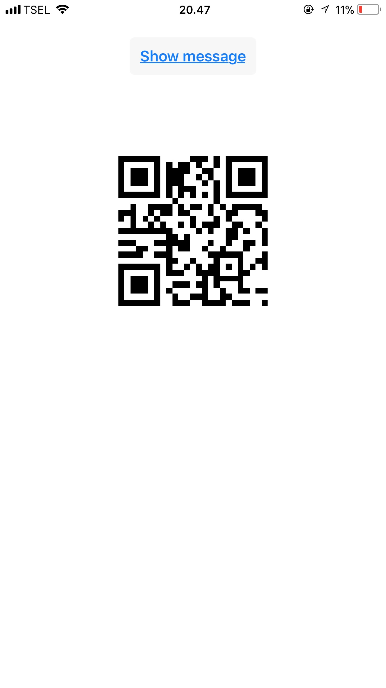

# Cordova - TabrisJS QR Code Generator plugin

for Android and iOS, by [Joko Rivai](https://github.com/jokorivai)


## 0. Index

1. [Description](#1-description)
2. [Screenshots](#2-screenshots)
3. [Installation](#3-installation)
	3. [Automatically (Cordoa CLI)](#automatically-cordova-cli)
	3. [Manually](#manually)
4. [Credits](#5-credits)
5. [Changelog](#6-changelog)

## 1. Description

This plugin allows you to generate QR Code within TabrisJS apps using plain javascript. Only for TabrisJS apps. Supported on Android and iOS (as platforms supported by TabrisJS).

This plugin is an adaptation of [Kazuhiko Arase](http://www.d-project.com/) Javascript QR Code Generator Library, initially released under MIT License.

Currently [TabrisJS](https://tabrisjs.com/) does not have any QR Code generator library, so this plugin may help you create QR Code TabrisJS within your TabrisJS applications.

* This plugins is pure JavaScript. No Java code used.
* QR Code generated to TabrisJS Canvas, or as in-memory image you can draw later to TabrisJS Canvas.
* Compatible with [Cordova CLI](https://cordova.apache.org/docs/en/latest/reference/cordova-cli/index.html).

## 2. Screenshots

iOS




Android


## 3. Installation

Install this plugin via Cordova CLI / NPM CLI.

```js
cd build/cordova
cordova plugin add cordova-plugin-tabrisjs-qrgen
```

To Use: 
```
const QRGen = window.tabrisJsPlugins.qrCode;
QRGen.GenerateQRToCanvas(textData, canvasObject, width, height);
```

### Manually

Grab a copy of `tabrisjsqrcode.js`, from `extracted-zip\www\` and put it to your project source's `www` folder and reference it:
```js
var QRCode = require('./tabrisjsqrcode.js');
QRCode.GenerateQRToCanvas(textData, canvasObject, width, height);
```

## 4. CREDITS

This plugin is based on [TabrisJS](http://tabrisjs.com).
The QR Code Javascript Generator code was entirely created by [Kazuhiko Arase](http://www.d-project.com/).
TabrisJS adaptation was done by me.


## 5. CHANGELOG

2018-04-16: 
  * Initial Commit